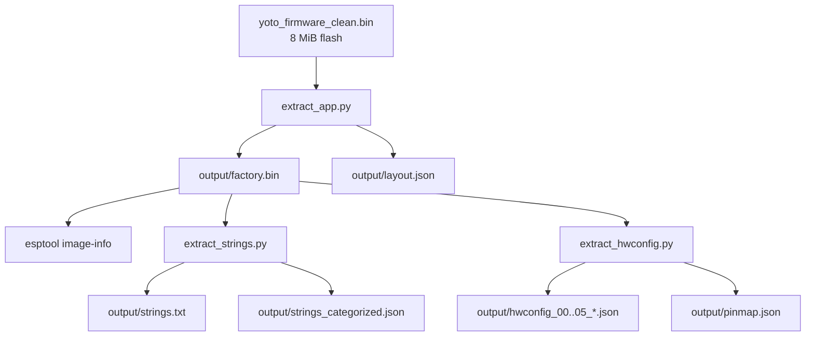

# Firmware Analysis Guide

The original flash dump is the source of truth. This workflow uses `esptool`
and the repository's byte-level extraction scripts; it does not require a GUI
disassembler or decompiler.

## Authoritative input

```text
~/Downloads/yoto_firmware_clean.bin
size:   8,388,608 bytes
sha256: 1db52091f892e05a9aec97605890b406f6734213214afef792e247353a75449e
```

Do not derive hardware behavior from prose documentation. Regenerate the
artifacts below from this input, then use the extracted image bytes, strings,
and embedded hardware-config JSON as evidence.

## Environment

```bash
uv sync
```

The required firmware tool is the `esptool` package already declared in
`pyproject.toml`. The remaining commands are repository-local Python scripts.

## Reproducible pipeline



## Step 1 — Extract partitions

```bash
uv run python analysis/extract_app.py ~/Downloads/yoto_firmware_clean.bin
```

`extract_app.py` parses the ESP32 partition table at flash offset `0x8000` and
writes every partition to `output/`. The authoritative layout is:

| Label | Flash offset | Size | State |
|---|---:|---:|---|
| `nvs` | `0x009000` | 192 KiB | populated |
| `otadata` | `0x039000` | 8 KiB | empty |
| `phy_init` | `0x03b000` | 4 KiB | empty |
| `factory` | `0x040000` | 2.5 MiB | populated app |
| `ota_0` | `0x2c0000` | 2.5 MiB | empty |
| `ota_1` | `0x540000` | 2.5 MiB | empty |

## Step 2 — Validate the factory image

```bash
uv run esptool image-info output/factory.bin
```

For this image, `esptool` reports:

| Field | Value |
|---|---|
| image type | ESP32 |
| image size | 2,621,440 bytes (partition including erased tail) |
| entry point | `0x400813a8` |
| segments | 7 |
| flash | 8 MB, 80 MHz, DIO |
| minimum chip revision | v3.0 |
| ESP-IDF | `v5.1.4-dirty` |
| image checksum | `0x85` (valid) |
| validation hash | `d9708da3097aa3f8fc1606cc5b9742a6aae0321515a05ffbdc65e296289a26e6` (valid) |

Segment addresses and file offsets are recorded in `output/layout.json`. Use
that generated file instead of copying addresses from documentation.

## Step 3 — Recover firmware strings

```bash
uv run python analysis/extract_strings.py
```

Outputs:

- `output/strings.txt`: unique printable strings in image order.
- `output/strings_categorized.json`: subsystem keyword matches.

These bytes expose driver names, initialization logs, mount paths, retry logic,
protocol diagnostics, source paths, and ESP-IDF/ADF version strings. For SD and
NFC work, search the regenerated output for `SD card`, `sdmmc`, `CR95HF`,
`NFC HAL`, and `UART`.

## Step 4 — Recover embedded hardware configs

```bash
uv run python analysis/extract_hwconfig.py
```

The script extracts six complete JSON documents embedded in DROM and writes a
flattened pin map. Relevant variants are:

| Config | Display | NFC | SD | Fuel gauge |
|---|---|---|---|---|
| `hwconfig_00` | GC9306 | UART | SDMMC 1-bit | CW2015 |
| `hwconfig_01` | HT16D35x | SPI | SPI | ADC |
| `hwconfig_02` | HT16D35x | UART | SDMMC 1-bit | CW2015 |
| `hwconfig_03` | incomplete | unknown | unknown | unknown |
| `hwconfig_04` | GC9306 | UART | SDMMC 4-bit | CW2215B |
| `hwconfig_05` | HT16D35x | UART | SDMMC 1-bit | CW2215B |

The JSON is firmware-owned configuration consumed at boot. It is authoritative
for transport selection and GPIO/IO-expander assignments.

## Evidence rules

1. Hash the input before analysis.
2. Regenerate outputs from that exact input.
3. Validate `output/factory.bin` with `esptool image-info`.
4. Treat embedded config and strings as primary evidence.
5. Mark behavior inferred from string order or diagnostics as inference.
6. Never promote an old documentation statement over contradictory image bytes.
