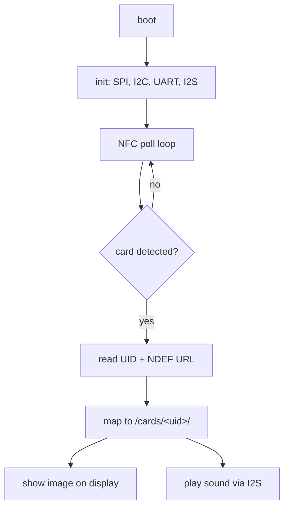

# Writing a Custom Rust Firmware

How to replace the stock Yoto firmware with your own Rust firmware that (a)
never enables Wi-Fi/BT and (b) lets you load your own sounds + pictures and
bind them to custom NFC cards.

!!! note "Hardware reality check"
    The original **ESP32 has no native USB controller**, so you cannot expose
    the SD card as a USB drive in software. "Pushing" content means either
    ejecting the SD card and copying files on a PC (simplest), or serial
    upload over a UART bridge. There is no Wi-Fi fallback because the goal is
    no connectivity.

## Goals → design



## Toolchain

Rust's ESP32 support comes from **esp-rs** (Espressif's official Rust org):

| Tool | Purpose |
|------|---------|
| `espup` | installs the Xtensa Rust toolchain + targets |
| `espflash` | flash + monitor the firmware |
| `esp-generate` | scaffold a project (`cargo generate esp-rs/esp-template`) |

Target: `xtensa-esp32-none-elf`.

## How "no Wi-Fi" is guaranteed

Use the **`no_std` `esp-hal`** stack. In it, the radio is **opt-in**: you never
link the `esp-wifi`/`esp-radio`/`esp-rtos` crates, so the Wi-Fi and Bluetooth
stacks are *not present in the binary at all*. No connectivity, by construction
— not just "disabled in config."

(The std `esp-idf-hal` route is the fallback if I2S/SD prove immature — it has
mature drivers but links the ESP-IDF, where you must strip radio via sdkconfig
and accept a larger binary.)

## Component map

| Peripheral | Rust approach |
|------------|---------------|
| NFC (CR95HF = ST25R95) | `st25r95` crate over SPI; `nfc_forum_tags` + `ndef` for Type 2 tag read/write |
| SD card | `embedded-sdmmc` (FAT16/32) over SPI, via `embedded-hal-bus` |
| Display (HT16D35x) | small custom `embedded-graphics` `DrawTarget` driver (16×16 framebuffer) |
| Display (GC9306 TFT) | `mipidsi` (DCS-compatible), `display-interface-spi` |
| Images | `tinybmp`/`tinytga` (or `minipng` for PNG), downscaled to 16×16 |
| Audio | I2S (`esp-hal`) + ES8388/aw881xx codec over I2C; play **WAV/PCM** (pre-decode on PC) |
| Buttons/encoders | `esp-hal` GPIO interrupts |

## Content loading (no USB, no Wi-Fi)

1. **Removable SD (recommended)** — eject the card, copy a folder layout onto
   it on a PC, reinsert. Zero transfer firmware to write.
2. **Serial upload** — XMODEM/YMODEM (`rmodem` crate) over the UART console
   bridge, into a filesystem write path.

Layout on the SD card:

```text
/cards/<uid>/sound.wav      # the audio to play
/cards/<uid>/image.bmp      # the 16x16 picture to show
```

## NFC card → sound + picture

Read the card's **UID** (7 bytes) with the CR95HF; use it as the directory
name. No need to write NDEF at all if you key purely on UID — but you can also
write a custom NDEF URI and parse it. To *create* cards, the same CR95HF can
write NDEF to blank NFC Forum Type 2 tags.

## Phased plan

1. Toolchain + LED blink + serial logging (`esp-hal`).
2. SD read: mount FAT32, list `/cards/`.
3. NFC read: poll for a card, read UID.
4. Audio: play a WAV from SD over I2S + codec.
5. Display: render a 16×16 image.
6. NFC write: program blank cards.
7. Polish: encoders, power button, battery gauge (optional).

Full crate list, exact commands, and gotchas are in the
[AI reference](ai/custom-firmware.md).
