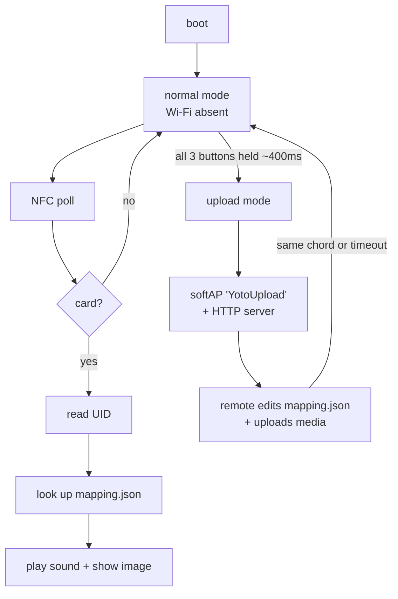

# Writing a Custom Rust Firmware

A replacement Rust firmware for the Yoto Player that:

- keeps **Wi-Fi/BT off by default** (radio is opt-in, never linked in the normal
  build),
- exposes a **hidden "upload mode"** — press all buttons at once to briefly
  bring up a Wi-Fi access point and edit a mapping file from a phone/laptop,
- reads that mapping when an **NFC card is scanned** to play the right sound and
  show the right picture.

## Modes



## Toolchain

Rust's ESP32 support comes from **esp-rs** (Espressif's official Rust org):

| Tool | Purpose |
|------|---------|
| `espup` | installs the Xtensa Rust toolchain + targets |
| `espflash` | flash + monitor the firmware |
| `esp-generate` | scaffold a project (`cargo generate esp-rs/esp-template`) |

Target: `xtensa-esp32-none-elf`.

## How Wi-Fi stays off

Use the **`no_std` `esp-hal`** stack. The radio driver (`esp-wifi` / `esp-radio`)
is a separate crate that is **opt-in** — the normal build simply doesn't include
it, so there is no radio code in the binary at all. The upload-mode AP is gated
behind a **cargo feature** (`upload-mode`), so it only exists when you enable it.

## The hidden upload mode

The device has three pressable buttons: the two rotary-encoder push buttons and
the power button. Holding **all three together for ~400 ms** toggles upload mode:

1. Firmware brings up a **softAP** (SSID `YotoUpload`, static `192.168.4.1`,
   with DHCP so a phone joins automatically).
2. A tiny HTTP server serves a status page and these endpoints:
   - `GET /mapping.json` — download the current mapping
   - `PUT /mapping.json` — replace it (raw JSON)
   - `PUT /media/<name>` — upload a sound/image file (raw bytes)
3. The 16×16 display shows a Wi-Fi/upload indicator while active.
4. The same chord (or a ~5-minute timeout) turns it back off.

The remote machine edits **one file** — `mapping.json` — which is the complete
binding between NFC cards and their media.

## The mapping file

`mapping.json` on the SD card (a plain JSON object keyed by card UID):

```json
{
  "cards": {
    "04A1B2C3D4E5F0": {
      "sound": "media/my-sound.wav",
      "image": "media/my-picture.bmp"
    },
    "11BB22CC334455": {
      "sound": "media/other.wav",
      "image": "media/other.bmp"
    }
  }
}
```

On scan, the firmware reads the card **UID** (7 bytes), looks it up, and plays
`sound` + renders `image`. Media files live under `/media/` on the same card.

## Component map

| Peripheral | Rust approach |
|------------|---------------|
| NFC (CR95HF = ST25R95) | `st25r95` crate over SPI; `nfc_forum_tags` + `ndef` |
| SD card | `embedded-sdmmc` (FAT16/32) over SPI, via `embedded-hal-bus` |
| Display (HT16D35x) | custom `embedded-graphics` `DrawTarget` driver (16×16 framebuffer) |
| Display (GC9306 TFT) | `mipidsi`, `display-interface-spi` |
| Images | `tinybmp`/`tinytga` (or `minipng`), downscaled to 16×16 |
| Audio | I2S (`esp-hal`) + ES8388/aw881xx codec over I2C; **WAV/PCM** |
| Buttons | poll IO expander at 5 ms + `debouncr` |
| Upload mode | `esp-radio` softAP + `edge-http` server (cargo feature) |

## Phased plan

1. Toolchain + LED blink + serial logging (`esp-hal`).
2. SD read: mount FAT32, parse `mapping.json`.
3. NFC read: poll CR95HF, read UID.
4. Audio + display: play a WAV, render a 16×16 image.
5. Upload mode: button chord → softAP + HTTP edit/upload.
6. Polish: encoders, power handling, battery gauge (optional).

Full crate list, exact commands, endpoint details, and gotchas are in the
[AI reference](ai/custom-firmware.md).
