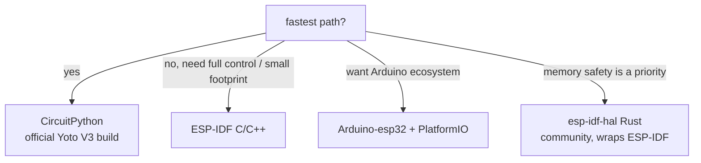

# Firmware Frameworks for ESP32

You asked what the *official* / *most popular* ways to write ESP32 firmware are.
Here they are, ranked, with how each fits your **esptool** flash workflow and
this specific project (NFC + SD + display + audio + hidden upload mode).

## Comparison

| Framework | Language | Status | esptool workflow |
|-----------|----------|--------|------------------|
| **ESP-IDF** | C/C++ | **Official**, canonical | `idf.py merge-bin` → `esptool write_flash 0x0` |
| **Arduino-esp32 + PlatformIO** | C++ | Official core + popular tool | `pio run -t upload` (drives esptool) |
| **CircuitPython / MicroPython** | Python | Official, easiest | single `.bin` at `0x1000` |
| **Rust (esp-rs)** | Rust | esp-hal official (narrow), esp-idf-hal community | `espflash save-image` or esptool |
| **Zephyr RTOS** | C | Vendor-backed | `west flash` (shells out to esptool) |

All five produce flashable `.bin` files that **esptool.py** reads/writes — so
your raw-flash workflow carries over unchanged.

## The short answer

- **Official + most control**: **ESP-IDF** (C/C++). It's what Espressif itself
  ships, and it's what every other option here is built on. Best peripheral
  coverage, smallest footprint, built-in OTA + partition tables.
- **Most popular for hobbyists**: **Arduino-esp32 + PlatformIO** (C++). Espressif's
  own Arduino core; huge library ecosystem.
- **Easiest for this exact device**: **CircuitPython**. Adafruit ships a released
  build for the **Yoto Player V3** board — flash one `.bin` and the SD, I2C IO
  expanders, buttons, I2S, SPI display and NFC pins are already wired up.
- **Rust**: `esp-hal` is genuinely Espressif-backed (1.0.0, Oct 2025), but its
  stable surface is narrow — I2S, SDMMC, NFC and the Wi-Fi driver are all still
  `unstable`. **Your "Rust support is limited" observation is correct** for this
  peripheral set.

## Recommendation for this project

- **Want it working this week** → CircuitPython (the Yoto V3 build already
  mounts SD, exposes I2C/SPI/I2S/UART; you write Python drivers for the codec,
  LED matrix, CR95HF, and the upload web server).
- **Want the "official" production path** → ESP-IDF in C/C++.
- **Want Rust specifically** → prefer `esp-idf-hal` (wraps ESP-IDF's mature
  drivers) over `esp-hal`, to avoid reimplementing FAT/codec/NFC/networking.

## Hardware notes

1. **The Yoto V3 has PSRAM** — the board definition declares 8 MB QIO flash +
   8 MB QIO PSRAM (ESP32-WROVER-E module).
2. **Adafruit already reversed this hardware** — the
   `Adafruit_CircuitPython_YotoPlayer` library exists. Their known gap: the
   `aw881xx`/`AW88194` speaker amp init sequence (speaker output unproven;
   headphone output via ES8156 works).

Full detail — exact commands, offsets, gotchas, and sources — is in the
[AI reference](ai/firmware-options.md).
