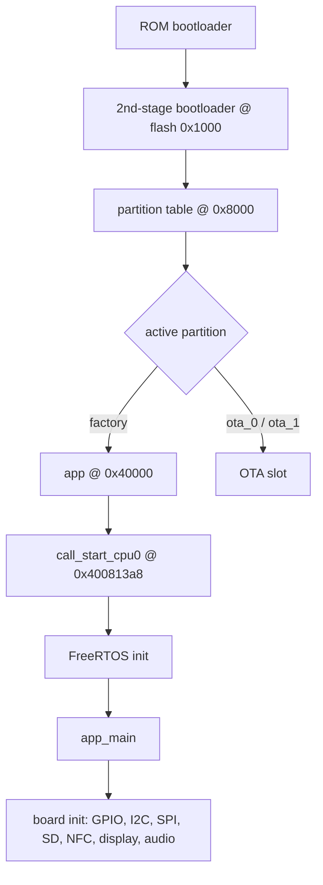
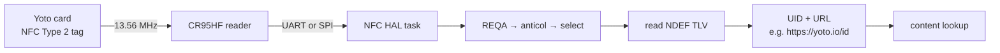
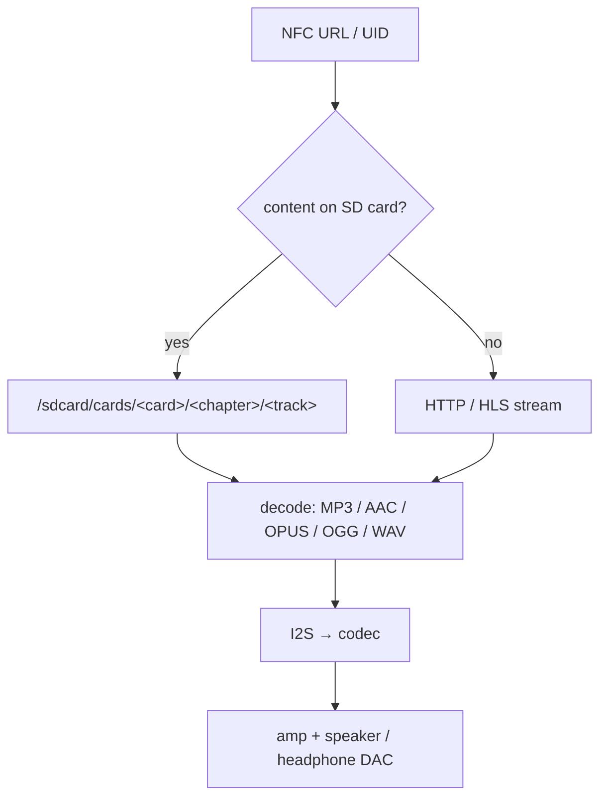
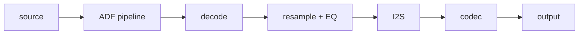
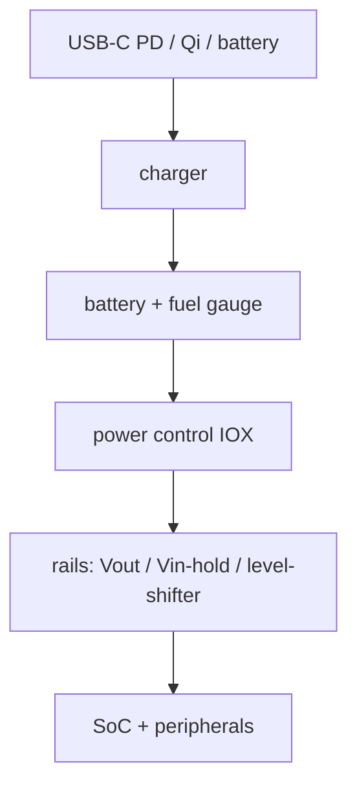
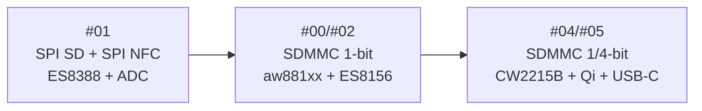

# Flow Charts

High-level data and control flow through the device.

## Boot

## NFC card read → content

## Content resolution (SD vs stream)

## Audio pipeline (ESP-ADF)

## Power

## Hardware revisions

