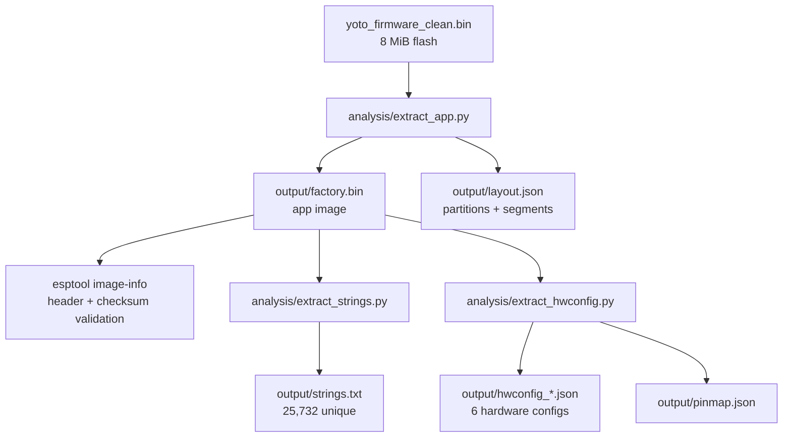

# Methodology

The reverse engineering workflow uses Espressif's `esptool` plus small Python
extractors managed with [`uv`](https://docs.astral.sh/uv/). It requires no GUI
disassembler or decompiler.

## Pipeline



## Steps

1. **Identification and extraction** — `analysis/extract_app.py` reads the
   original 8 MiB dump, parses the partition table at `0x8000` (magic `AA 50`,
   32-byte entries), and writes every partition to `output/`.

2. **App-image validation** — verify the extracted factory application with
   Espressif's tool:

   ```bash
   uv run esptool image-info output/factory.bin
   ```

   This reports the chip, image entry point, flash parameters, segment load
   addresses, image checksum, validation hash, and ESP-IDF version directly
   from the application image.

3. **String recovery** — `analysis/extract_strings.py` extracts and categorizes
   printable strings. Driver names, boot order, mount paths, failure messages,
   and protocol diagnostics come from these bytes in the original image.

4. **Hardware-config recovery** — `analysis/extract_hwconfig.py` locates the
   embedded JSON hardware descriptions and flattens every `GPIO.x`, `ADC.x`,
   and `IOX.p.n` assignment into `output/pinmap.json`.

## Why the hardware config JSON is authoritative

The firmware stores a complete, per-revision hardware description as JSON in
the DROM segment. This is the device's own pin map — more reliable than
inferring pins from decompiled `gpio_config()` calls, because it is the exact
data the firmware consumes at boot to configure every peripheral. Six such
documents are present, corresponding to six hardware generations.

## Artifacts

| Path | Content |
|------|---------|
| `output/factory.bin` | factory app image (header at offset 0) |
| `output/layout.json` | partition table + segment map |
| `output/strings.txt` | all unique printable strings |
| `output/strings_categorized.json` | strings grouped by subsystem |
| `output/hwconfig_*.json` | the six hardware-config documents |
| `output/pinmap.json` | flattened GPIO/ADC/IOX → function map |
| `analysis/extract_app.py` | partition and app-image extractor |
| `analysis/extract_strings.py` | printable-string extractor and categorizer |
| `analysis/extract_hwconfig.py` | embedded config and pin-map extractor |

All scripts run under `uv` (`.python-version` = 3.13):

```bash
uv run python analysis/extract_app.py ~/Downloads/yoto_firmware_clean.bin
uv run esptool image-info output/factory.bin
uv run python analysis/extract_strings.py
uv run python analysis/extract_hwconfig.py
```

