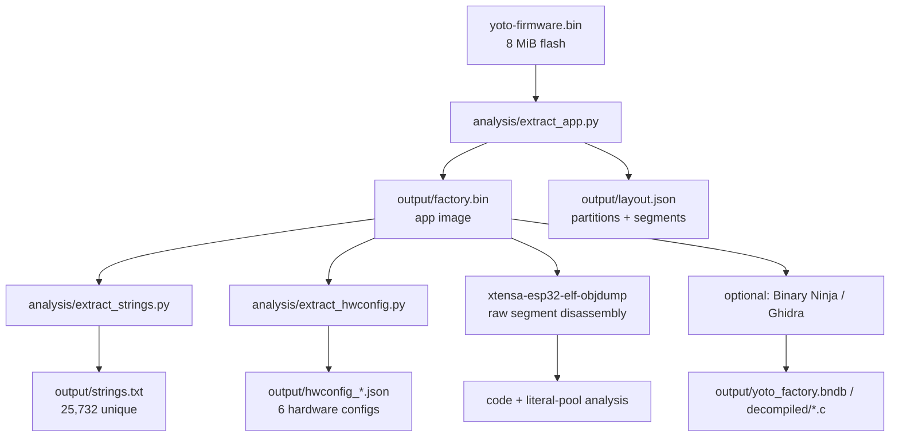

# Methodology

The reverse engineering was driven by a Python toolchain managed with
[`uv`](https://docs.astral.sh/uv/). Xtensa disassembly uses the **Espressif
ESP-IDF toolchain's `xtensa-esp32-elf-objdump`** (no GUI, no Ghidra);
Binary Ninja (ESPFirmware + Xtensa plugins) and Ghidra/PyGhidra are optional
GUI extras.

## Pipeline



## Steps

1. **Identification** — `file` + magic-byte scan identified the image header
   (`0xE9`) and chip ID `0x0000` = **ESP32** (Xtensa LX6). `strings` confirmed
   ESP-IDF (`boot.esp32`, `esp_image`, `phy_init`, `nvs.net80211`).

2. **Partition parsing** — a small Python parser read the partition table at
   `0x8000` (magic bytes `AA 50`, 32-byte entries) and dumped each partition.

3. **App extraction** — the **factory** partition (`0x40000`, 2.5 MB) was
   extracted to `output/factory.bin` (an ESP32 app image whose header is at
   offset 0). The 7 segments were parsed (load address + size).

4. **Xtensa disassembly (Espressif objdump — primary)** — no Ghidra
   required. The ESP-IDF toolchain ships `xtensa-esp32-elf-objdump`
   (`~/.espressif/tools/xtensa-esp-elf/*/xtensa-esp-elf/bin/`, or on `PATH`
   after `source $IDF_PATH/export.sh`). Slice the code segments out of
   `output/factory.bin` (the 7-segment table is in `output/layout.json`),
   then disassemble each at its real load address:

   ```bash
   # IROM: vaddr 0x400D0020, file offset 0xB0020, size 0x18F0CC
   python3 -c "d=open('output/factory.bin','rb').read(); \
     open('/tmp/irom.bin','wb').write(d[0xB0020:0xB0020+0x18F0CC])"
   xtensa-esp32-elf-objdump -D -b binary -m xtensa --adjust-vma=0x400D0020 \
     /tmp/irom.bin > /tmp/irom.dis
   ```

   Xtensa gotchas (see `ai/decompile.md` for detail): functions open with
   `entry`; `call8` shifts the register window (caller `a10`→callee `a2`);
   linear decode drifts at embedded literal pools — re-anchor windows at a
   function address with `--adjust-vma=<fn addr>`; `l32r` lines print the
   loaded value in parens, so `grep '(0x3f4xxxxx)'` finds string/data
   references (fixing the L32R xref gap Ghidra has).

5. **String + config recovery** — `analysis/extract_strings.py` extracts and
   categorizes strings; `analysis/extract_hwconfig.py` locates the embedded
   JSON hardware-configuration documents and flattens every `GPIO.x` /
   `ADC.x` / `IOX.p.n` assignment into `output/pinmap.json`.

6. **Optional GUI passes** — Binary Ninja's **`ESPFirmware`** view
   (`bnesp32`) + the `binja-xtensa` arch plugin loads segments at real
   addresses and adds ~2,000 ESP32 ROM symbols (decompilation uses the
   third-party Xtensa plugin — BN Personal has no built-in Xtensa).
   Ghidra 12 / PyGhidra (`analysis/ghidra_decompile.py`) provides C-level
   decompilation (81,667 functions) but needs a Ghidra install and its
   L32R xrefs are unreliable; use it only when C pseudocode is worth the
   setup.

## Why the hardware config JSON is authoritative

The firmware stores a complete, per-revision hardware description as JSON in
the DROM segment. This is the device's own pin map — more reliable than
inferring pins from decompiled `gpio_config()` calls, because it is the exact
data the firmware consumes at boot to configure every peripheral. Six such
documents are present, corresponding to six hardware generations.

## Artifacts

| Path | Content |
|------|---------|
| `output/factory.bin` | factory app image (header at offset 0) |
| `output/layout.json` | partition table + segment map |
| `output/strings.txt` | all unique printable strings |
| `output/strings_categorized.json` | strings grouped by subsystem |
| `output/hwconfig_*.json` | the six hardware-config documents |
| `output/pinmap.json` | flattened GPIO/ADC/IOX → function map |
| `output/ghidra_functions.json` | 81k functions with addresses (Ghidra) |
| `output/decompiled/*.c` | decompiled entry-point call tree (Ghidra) |
| `output/yoto_factory.bndb` | Binary Ninja database (correct type, analyzed) |
| `analysis/*.py` | the extraction/analysis scripts |

All scripts run under `uv` (`.python-version` = 3.13):

```bash
uv run python analysis/extract_app.py
uv run python analysis/extract_strings.py
uv run python analysis/extract_hwconfig.py
GHIDRA_INSTALL_DIR=/opt/homebrew/Cellar/ghidra/12.0.4/libexec \
  uv run python analysis/ghidra_decompile.py
```

