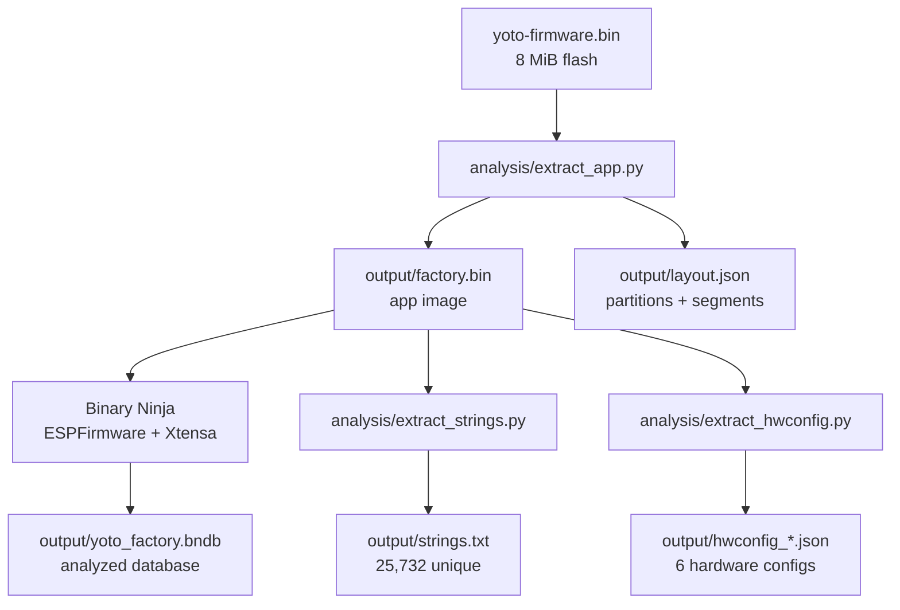

# Methodology

The reverse engineering was driven by a Python toolchain managed with
[`uv`](https://docs.astral.sh/uv/), plus Binary Ninja (with the ESP32/Xtensa
plugins) for decompilation.

## Pipeline



## Steps

1. **Identification** — `file` + magic-byte scan identified the image header
   (`0xE9`) and chip ID `0x0000` = **ESP32** (Xtensa LX6). `strings` confirmed
   ESP-IDF (`boot.esp32`, `esp_image`, `phy_init`, `nvs.net80211`).

2. **Partition parsing** — a small Python parser read the partition table at
   `0x8000` (magic bytes `AA 50`, 32-byte entries) and dumped each partition.

3. **App extraction** — the **factory** partition (`0x40000`, 2.5 MB) was
   extracted to `output/factory.bin` (an ESP32 app image whose header is at
   offset 0). The 7 segments were parsed (load address + size).

4. **Correct Binary Ninja load** — the app image is opened with the
   **`ESPFirmware`** BinaryView type (community plugin `bnesp32`), which
   auto-detects the chip, creates segments at their real addresses
   (`0x3F400020` DROM, `0x40080000` IRAM, `0x400D0020` IROM, `0x3FFBDB60`
   DRAM), and loads ~2,000 ESP32 ROM symbols. Decompilation uses the
   third-party **Xtensa** architecture plugin (`binja-xtensa`), since Binary
   Ninja Personal has no built-in Xtensa support.

5. **Xtensa decompilation (Ghidra / PyGhidra)** — `analysis/ghidra_decompile.py`
   loads the app image with the correct ESP32 memory map, runs auto-analysis
   (81,667 functions), decompiles the entry-point call tree, and exports
   `output/decompiled/*.c`, `output/ghidra_functions.json`, and
   `output/string_xrefs.json`. Ghidra 12's SLEIGH Xtensa is far faster than
   Binary Ninja's Python Xtensa plugin, so it is the primary decompilation
   engine; Binary Ninja provides the ROM symbols.

6. **String + config recovery** — `analysis/extract_strings.py` extracts and
   categorizes strings; `analysis/extract_hwconfig.py` locates the embedded
   JSON hardware-configuration documents and flattens every `GPIO.x` /
   `ADC.x` / `IOX.p.n` assignment into `output/pinmap.json`.

## Why the hardware config JSON is authoritative

The firmware stores a complete, per-revision hardware description as JSON in
the DROM segment. This is the device's own pin map — more reliable than
inferring pins from decompiled `gpio_config()` calls, because it is the exact
data the firmware consumes at boot to configure every peripheral. Six such
documents are present, corresponding to six hardware generations.

## Artifacts

| Path | Content |
|------|---------|
| `output/factory.bin` | factory app image (header at offset 0) |
| `output/layout.json` | partition table + segment map |
| `output/strings.txt` | all unique printable strings |
| `output/strings_categorized.json` | strings grouped by subsystem |
| `output/hwconfig_*.json` | the six hardware-config documents |
| `output/pinmap.json` | flattened GPIO/ADC/IOX → function map |
| `output/ghidra_functions.json` | 81k functions with addresses (Ghidra) |
| `output/decompiled/*.c` | decompiled entry-point call tree (Ghidra) |
| `output/yoto_factory.bndb` | Binary Ninja database (correct type, analyzed) |
| `analysis/*.py` | the extraction/analysis scripts |

All scripts run under `uv` (`.python-version` = 3.13):

```bash
uv run python analysis/extract_app.py
uv run python analysis/extract_strings.py
uv run python analysis/extract_hwconfig.py
GHIDRA_INSTALL_DIR=/opt/homebrew/Cellar/ghidra/12.0.4/libexec \
  uv run python analysis/ghidra_decompile.py
```

