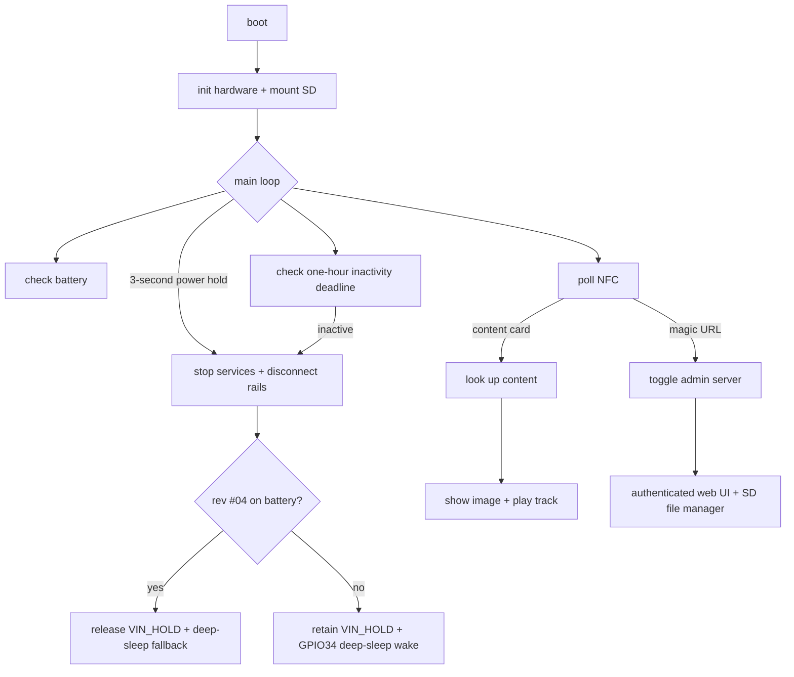
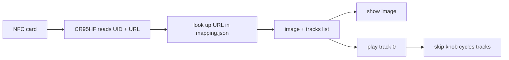

# open-yoto-firmware

A from-scratch firmware for the Yoto Player (ESP32). It reads NFC cards,
plays matching audio + pictures, and starts an offline administration hotspot
and web server on every boot. No cloud connection is required.

This page explains the logic in plain terms. The decompilation-based
understanding of the *original* firmware is elsewhere (see
[Hardware & Ports](hardware.md) and the [AI reference](ai/index.md)).

## The big picture



## What it does

1. **Scans an NFC card** → reads its URL.
2. **Looks up that URL** in a file on the SD card (`mapping.json`).
3. **Plays the matching audio** (MP3) and **shows the matching picture**
   (legacy or color 16×16; older replacement OYIM 64×64 remains readable).
4. The two knobs control **volume** (left) and **track skip** (right); pressing
   them **pauses**. Long-pressing the right knob or the power button turns the
   device **off/on**. Turning the right knob with no card loaded winks the face;
   turning the left knob shows a volume bar redrawn at most once per 100 ms with
   the newest level. Turning both composes: the bar is re-applied over each wink
   frame instead of the two screens taking turns.
5. On boot, starts the open `openyoto` hotspot and web UI. A random
   six-character alphanumeric code is shown as two rows of three glyphs. Rev
   #04 renders a native 5×7 font at 9× scale inside the panel's verified
   240×240 visible region and compensates for the MADCTL horizontal mirror;
   rev #05 uses a compact 5×7 matrix fallback. The authenticated UI provides
   player remote control, card mappings, and full SD file/directory management.

## The components

| Component | Job |
|-----------|-----|
| `board` | the pin map (which wire goes where) |
| `iox` | the two I/O expander chips (buttons, display, power control) |
| `battery` | fuel-gauge + battery level / low-battery detection |
| `ht16d35x` | the 16×16 LED display |
| `cr95hf` | the NFC card reader |
| `encoder` | the two rotary knobs + push buttons + power button |
| `content` | the SD card + optional `mapping.json` catalog |
| `audio` + `codec_es8156` + Espressif decoders | MP3/AAC/M4A playback → I²S |
| `admin` | on-demand hotspot, authenticated API, remote control, SD manager |
| `yoto_vfs` | read-only embedded `/system` assets |
| `main` | ties it all together (the state machine) |

## Boot sequence

On power-up, in order:

1. Initialize settings storage (erase it if it's corrupt).
2. Start the I²C bus + both I/O expanders.
3. Initialize the CW2215B battery monitor.
4. Initialize the accelerometer, display, audio, and codec.
5. If no external power is present, refuse normal startup below the stock 4%
   SOC threshold.
6. Queue the stock welcome audio, then play `face-01.png`…`face-08.png` at
   16 fps, resting on `face-08` (the idle face). A depleted battery replaces
   that resting face with its `battery-*.png` icon as soon as the animation
   ends.
7. Initialize the NFC reader and rotary encoders/buttons.
8. Mount the SD card and load the optional content catalog.

Admin services remain off at boot. Scanning the exact admin magic URL starts
the `openyoto` SoftAP, creates a six-character code, and starts the HTTP server
on demand.

## The main loop (the state machine)

The loop handles deferred physical-control work first, then:

1. **Poll NFC** every ~100 ms.
2. Refresh charger state and run the unconditional five-second critical-battery
   policy, including while admin mode owns the display.
3. Update noncritical battery warnings when the access-code screen is not pinned.
4. Maintain display-transient deadlines.
5. Check the one-hour inactivity deadline.

A card is "new" on a rising edge or when its UID changes (a swap within one
poll window):

- **Magic URL** (`https://openyoto.com/admin`) → explicitly toggle the
  on-demand admin server.
- **Admin active** → capture UID and URL for `/api/last-card`; do not resolve a
  mapping, change the screen, or start card playback. Blank cards are captured
  by UID with an empty URL.
- **Admin inactive** → perform normal catalog lookup, image display, and audio
  playback.

Removing the card stops playback; a swap (or rapid remove/re-insert) is
detected by UID change, not just presence.

The knobs/buttons are handled as events (not polled in the main loop):

| Input | Action |
|-------|--------|
| Left knob turn | volume (5 per click, 0–100); bar redraw coalesced to 100 ms, plus one 45 ms 880 Hz blip per detent when nothing is playing |
| Right knob turn | skip track (wraps around); with no card, winks the face |
| Either knob press (short) | play / pause |
| Power button press | toggle only the screen; screen-on shows the current battery icon |
| Power button hold (3 s) | stop playback/admin, blank the display, disconnect the amp and downstream rails, then enter the board-specific terminal state |

Encoder actions and card insertion/removal reset the inactivity deadline.
Playback and an active admin session continuously defer it. After the stock
default of one hour without any of those activities, the firmware runs the
same shutdown sequence as the three-second power hold.

On rev #04, battery-powered shutdown isolates GPIO12 and releases `VIN_HOLD`;
deep sleep is only a fallback if the physical latch does not remove power.
When rev #04 is externally powered, it retains the latch, clears stale ET6416
input transitions, and enters deep sleep with active-low GPIO34 wake armed.
Rev #05 always retains `VIN_HOLD`; its PI4IOE5V6416 power-button input is
unmasked and GPIO34 is armed before deep sleep. An EXT0 reset is accepted as a
real wake only after the active-low power button remains held for two seconds;
a released/spurious wake disconnects the rails and returns to deep sleep. The
firmware does not timer-poll the button in light sleep.

The display carries one **base screen** (idle face, card art, admin code, or a
low-battery warning) plus **transients** that expire back onto it: the wink
(300 ms), the volume bar (1.5 s after the last detent), and the battery glimpse
(5 s). Transients compose rather than pre-empt each other — every icon frame
re-applies a live volume bar — and each expiry repaints the base underneath.

Volume feedback is audible as well as visual. With nothing playing, a volume
change makes no sound at all, so a dedicated task plays one short sine blip per
detent at the new level — continuous feedback while the knob turns, and the blip
goes through the same PCM gain as content, so it *is* the new loudness. Content
always wins: `audio_play_blip()` refuses while a stream is loaded, playing or
paused.

For the record, the stock firmware makes **no** sound when its volume knob is
turned: `_ui_clicks_to_volume` applies the level synchronously and its only timer
(`volume_timer`, 1.5 s one-shot) just coalesces a display redraw. Stock's sine
tone generator is reachable only from the `audiobeep` console command, the
factory inspection self-test, and `prodtestchecks`, and none of the ten embedded
M4A `/system/sounds/*` assets is a volume click. The blip is therefore this
firmware's own addition, matching stock's *waveform* (sine at 44.1 kHz) rather
than copying a stock sound that does not exist.

## Card → playback flow



- The NFC reader talks over UART (57,600 baud). It reads the card's UID (4 or
  7 bytes) and its **NDEF URL**.
- The **URL is the key** (not the UID). `mapping.json` maps each URL to an
  ordered list of audio tracks, each with an optional per-track image:

  ```json
  {"cards": [{"url": "https://example.com/card",
              "image": "media/cover.img",
              "tracks": ["media/track1.mp3", "media/track2.mp3"],
              "track_images": ["media/track1.img", "media/track2.img"]}]}
  ```

- Browser-generated `.img` files use the replacement's **OYIM v1** format:
  an 8-byte `OYIM`, version, RGB565, 16×16 header followed by 512 bytes of
  little-endian RGB565 pixels. The admin UI decodes PNG/JPEG, stretches it to
  the full 16×16 canvas, previews the exact color frame, and uploads the
  resulting 520-byte file.
- **rev #04 (GC9306)**: OYIM images retain color and scale 12× into the
  centered `(24,24)..(215,215)` 192×192 content window—the same fit used by
  stock-sized battery art. The output driver compensates for the panel's
  `MADCTL=0x48` horizontal mirror and its observed RGB666 R/B swap.
- **rev #05 (HT16D35x)**: the hardware is monochrome and physically 16×16, so
  RGB565 is converted to luminance without spatial resampling. Color cannot be
  retained on that display.
- The volume bar is a 144×12 px band centred in that window (panel x 48…191,
  y 199…210), drawn as at most four RGB666 rects—three colour bands plus the
  black remainder that lets the bar shrink. Each `gc9306_fill_rect()` costs
  IOX I²C round trips for CS/DC, so the previous one-rect-per-column bar made
  the knob feel unresponsive. rev #05 draws the same bar as two 12-cell rows
  (logical x 2…13, y 14…15).
- Legacy 32-byte 16×16 one-bit `.img` masks remain readable on both revisions.
  Previously generated 64×64 OYIM files are also accepted and use their older
  3× rendering path on the GC9306.

## Audio pipeline

```text
SD MP3 ─────────> Espressif MP3 ─┐
SD ADTS AAC ────> Espressif AAC ─┼─> metadata-aware resample
SD / VFS M4A ──> MP4 tables + AAC┘   ─> mono 44.1 kHz PCM
                                            └─> I2S ─> ES8156 + AW881xx
```

- Normal boot plays only `/system/sounds/welcome`. The path is provided by a
  read-only `YOTO_VFS`; it is not an SD file.
- The embedded welcome asset is the exact 18,608-byte factory M4A from DROM
  `0x3f45014b–0x3f4549fb` (SHA-256
  `595d30ff7074658b6cda26d0412655e7adfb1e92c69ead2cbc0080eced895e2d`).
- Its MP4 sample tables describe 167 mono AAC-LC access units at 44.1 kHz.
  The replacement streams `stsd`/`stsz`/`stsc`/`stco` or `co64`, decodes all
  171,008 samples, and pushes 16-bit mono PCM through the stock APLL I²S path.
  Sample-size lookups reuse the table handle, so playback needs only the two
  descriptors provided by the embedded `/system` VFS.
- Local content supports MP3, standalone ADTS AAC, and M4A/AAC-LC. Format
  selection uses file signatures rather than extensions. Decoded source rate
  and channels drive stereo downmix and stateful 8–96 kHz conversion to the
  oracle's fixed 44.1 kHz mono sink; bounded PCM gain affects speaker and
  headphone output.
- Rev #04 uses one AW88194A at 7-bit `0x34`. The replacement reproduces the
  factory ET6416 reset, register table, SmartK firmware/configuration, VCALB,
  DSP/I²S/PLL checks, interrupt setup, and hard-unmute.
- `CONFIG_APP_SPEAKER_TEST_TONE` is disabled for normal boot. It remains a
  manual bring-up option and never runs alongside the configured welcome-only
  startup.

## On-demand admin web UI

Scanning a card containing the exact URI `https://openyoto.com/admin` starts
an open Wi-Fi hotspot named `openyoto`, assigns the player `192.168.4.1`, and
shows a random six-character alphanumeric code. Visiting
`http://192.168.4.1` and entering that code exchanges it for an HttpOnly,
SameSite session cookie. Every API and file read requires that cookie.

If `/sdcard/webui/index.html` does not exist, the root redirects to an embedded
installer. After login, the user uploads the provided
[`index.html`](https://raw.githubusercontent.com/tensorfish/open-yoto/main/firmware/components/admin/html/index.html).
The player then serves that SD-hosted file on future visits, allowing the page
to be customized or replaced without rebuilding the firmware. See
[Post-flash setup](firmware/post-flash-setup.md) for the complete walkthrough.

The unlocked responsive UI has four areas:

- **Remote control** — play or stop MP3, ADTS AAC, and M4A/AAC-LC files;
  display an existing `.img`, clear the physical screen, or convert a PNG/JPEG
  to 16×16 RGB565 for preview, upload, and immediate display. Every
  asynchronous action reports progress, success, or failure.
- **Media files** — browse from the fixed `/sdcard/media` root; upload/download
  files; create directories/files; rename entries; delete files and empty
  directories. The path field can navigate descendants but rejects any path
  outside `/sdcard/media` as well as `.`/`..`. FatFs preserves UTF-8, mixed
  case, and names up to 96 characters.
- **Tracks** — choose one whole folder containing audio and images. The browser
  validates paths and collisions, converts PNG/JPEG to 520-byte 16×16 RGB565
  OYIM files, creates the tree under `/sdcard/media`, uploads sequentially with
  visible progress/retry state, and lazily lists current playable assets.
- **Cards** — inspect mappings; manually refresh or poll the last captured card
  while the URL field is empty; distinguish blank tags by UID; and write a URL
  back only when the tag in the field matches the captured UID.

Remote playback, knobs, and buttons continue operating while the web UI is
active. Physical card scans are deliberately capture-only during admin mode.

### Memory-bounded, request-driven loading

The web UI does not preload every subsystem after login:

1. Login requests only the default media directory
   (`/api/fs/list?path=/sdcard/media`).
2. Opening a directory requests that one level only; traversal is never
   recursive.
3. Card mappings and capture state load only when **Cards** is selected.
   Automatic capture polling runs only while its URL field is empty.
4. Recursive track discovery runs only while **Tracks** is selected and uses
   one bounded directory request at a time; switching tabs invalidates stale
   traversal results.
5. Directory JSON is streamed one entry at a time rather than building a whole
   server-side tree and a second response copy.
6. `mapping.json` is parsed only on the first NFC/card-mapping request.
7. MP3 and AAC decoder state exists only for active playback and is then freed.
8. Every web UI file, playback, display, and folder-upload path is confined to
   `/sdcard/media`; lower-level authenticated filesystem APIs retain explicit
   `/sdcard/...` paths for non-UI clients.

The HTTP task stack is 16 KiB rather than 32 KiB. The 9.6 KiB native access
code raster is temporary and released before Wi-Fi starts. Heap checkpoints
are logged before Wi-Fi, before HTTP startup, when admin becomes active, and
on every explicit allocation failure.

Authenticated routes include:

```text
POST /api/login
POST /api/control/play
POST /api/control/display
POST /api/control/stop
POST /api/control/clear
GET  /api/fs/list
GET  /api/fs/file
POST /api/fs/upload
POST /api/fs/create
POST /api/fs/mkdir
POST /api/fs/rename
POST /api/fs/delete
GET  /api/list
GET  /api/last-card
POST /api/card/write
POST /api/add
POST /api/delete
GET  /media/*
```

Filesystem route `path` values, and `from`/`to` rename values, must be explicit
absolute `/sdcard` paths. Control requests from the web UI also send explicit
`/sdcard` paths.

## Power & battery

- Battery state comes from the CW2215B after loading the exact board-specific
  80-byte profile, activating the gauge, and waiting for ready state. VCELL and
  SOC are read only after initialization succeeds.
- Battery-only normal startup requires at least **4% SOC**, matching the stock
  `BATT_THRS_START` default.
- **Low battery** = SOC at or below **7%**, matching the stock
  `BATT_THRS_WRNG` default.
- **Critical battery** = two consecutive valid five-second readings at or below
  **3% SOC** while a fresh charger status read confirms no external power. This
  shutdown policy runs even in admin mode. Invalid reads, external power, or a
  recovered SOC reset confirmation instead of being treated as an empty cell.
- The battery screen comes from `firmware/icons/battery-*.png`. Each icon covers
  the ten points up to its label — `battery-10.png` is 0–10%, `battery-20.png`
  is 11–20%, through `battery-100.png` for 91–100% — and `battery-empty.png`
  appears only when the gauge reading is unavailable. While charging, the
  charge-level animation is shown instead: `battery-charging-0.png` for 0–9%,
  `battery-charging-10.png` for 10–19%, and so on to `battery-charging-100.png`
  at 100%.
- Battery info never fights the face. Charging is announced as a glimpse on the
  not-charging → charging **edge** and at boot; it covers the base screen for
  5 s and then hands it back. The 30 s re-check only logs while charging. A
  right-knob twist with no card loaded winks and rests on the face,
  taking the display back from the charging icon. Only a **low** battery
  re-asserts itself over whatever is on screen.
- On every USB plug-in, the firmware uses the SGM41513 `PG_STAT` bit as the
  authoritative power-source signal, restores the board-specific charger
  settings at I²C address `0x1A`, and clears that cached configuration when
  a successful status read shows power-good has disappeared. A bus error is
  unknown state, not an unplug event. Rev #04 preserves the SGM41513's D+/D−
  source-detected input-current limit while applying the stock 2220 mA
  battery-charge request; this avoids input-voltage DPM cycling on weak USB
  supplies. Rev #05 derives a limit up to 2.4 A from the attached HUSB238
  Type-C/PD contract and retains the charger's conservative detected limit if
  no contract can be read.
- While power-good stays asserted, a masked audit checks the charger every
  30 seconds and repairs reset/watchdog drift without overwriting IINDPM or
  clearing a latched `BATFET_DIS` protection. Charging UI uses the SGM41513
  `CHRG_STAT` state instead of the unreliable board `plugstat`/`chgstat` lines.
  A transition counts only after four consecutive 500 ms samples agree, and a
  glimpse appears at most once every 30 s.
- A three-second power-button hold, or one hour without input, playback, or an
  active admin session, stops audio/admin, blanks the display, and disables the
  amplifier and downstream rails. Battery-powered rev #04 then releases
  `VIN_HOLD`; externally powered rev #04 and all rev #05 shutdowns retain it
  and enter deep sleep with active-low GPIO34 wake armed. GPIO12 is isolated in
  every deep-sleep path.
