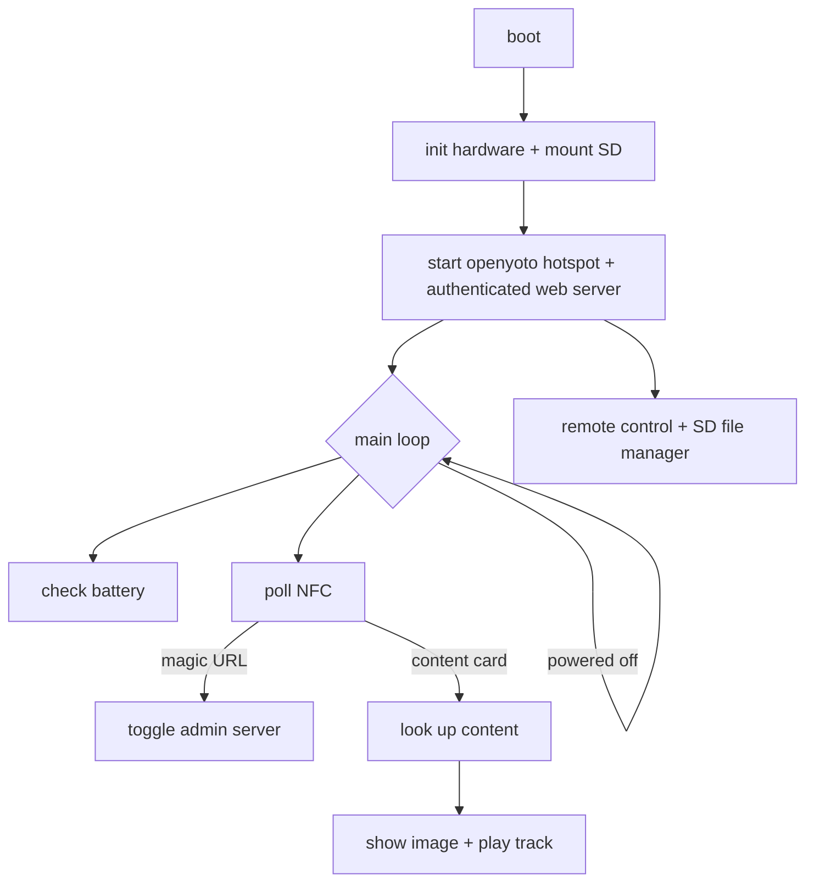
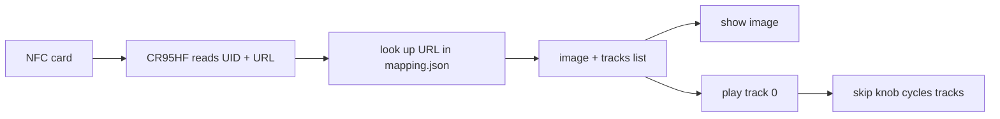

# open-yoto-firmware

A from-scratch firmware for the Yoto Player (ESP32). It reads NFC cards,
plays matching audio + pictures, and starts an offline administration hotspot
and web server on every boot. No cloud connection is required.

This page explains the logic in plain terms. The decompilation-based
understanding of the *original* firmware is elsewhere (see
[Hardware & Ports](hardware.md) and the [AI reference](ai/index.md)).

## The big picture



## What it does

1. **Scans an NFC card** → reads its URL.
2. **Looks up that URL** in a file on the SD card (`mapping.json`).
3. **Plays the matching audio** (MP3) and **shows the matching picture**
   (legacy or color 16×16; older replacement OYIM 64×64 remains readable).
4. The two knobs control **volume** (left) and **track skip** (right); pressing
   them **pauses**. Long-pressing the right knob or the power button turns the
   device **off/on**.
5. On boot, starts the open `openyoto` hotspot and web UI. A random
   six-character alphanumeric code is shown as two rows of three glyphs. Rev
   #04 renders a native 5×7 font at 9× scale inside the panel's verified
   240×240 visible region and compensates for the MADCTL horizontal mirror;
   rev #05 uses a compact 5×7 matrix fallback. The authenticated UI provides
   player remote control, card mappings, and full SD file/directory management.

## The components

| Component | Job |
|-----------|-----|
| `board` | the pin map (which wire goes where) |
| `iox` | the two I/O expander chips (buttons, display, power control) |
| `battery` | fuel-gauge + battery level / low-battery detection |
| `ht16d35x` | the 16×16 LED display |
| `cr95hf` | the NFC card reader |
| `encoder` | the two rotary knobs + push buttons + power button |
| `content` | the SD card + optional `mapping.json` catalog |
| `audio` + `codec_es8156` + Espressif decoders | MP3/AAC/M4A playback → I²S |
| `admin` | boot-time hotspot, authenticated API, remote control, SD manager |
| `yoto_vfs` | read-only embedded `/system` assets |
| `main` | ties it all together (the state machine) |

## Boot sequence

On power-up, in order:

1. Initialize settings storage (erase it if it's corrupt).
2. Start the I²C bus + both I/O expanders.
3. Battery monitor.
4. 16×16 display.
5. NFC reader.
6. Rotary encoders + buttons.
7. SD card + optional content catalog.
8. Audio and stock welcome playback.
9. `openyoto` SoftAP, six-character code, and HTTP server.

The web server remains in the background while the NFC/encoder main loop runs.

## The main loop (the state machine)

The loop keeps physical controls active while the web server runs:

1. **Powered off?** → sleep 200 ms; button events remain active.
2. **Poll NFC** every ~100 ms.
3. Periodically check battery state when the access-code screen is not pinned.

A card is "new" on a rising edge or when its UID changes (a swap within one
poll window):

- **Magic URL** (`https://openyoto.local/admin`) → explicitly toggle the
  otherwise boot-enabled admin server.
- **Admin active** → capture UID and URL for `/api/last-card`; do not resolve a
  mapping, change the screen, or start card playback. Blank cards are captured
  by UID with an empty URL.
- **Admin inactive** → perform normal catalog lookup, image display, and audio
  playback.

Removing the card stops playback; a swap (or rapid remove/re-insert) is
detected by UID change, not just presence.

The knobs/buttons are handled as events (not polled in the loop):

| Input | Action |
|-------|--------|
| Left knob turn | volume (5 per click, 0–100) |
| Right knob turn | skip track (wraps around) |
| Either knob press (short) | play / pause |
| Right knob press (long, ~0.8 s) | power off/on |
| Power button | power off/on |

Simultaneous or rapid presses are debounced so a double press can't
double-toggle power or cancel a play/pause.

## Card → playback flow



- The NFC reader talks over UART (57,600 baud). It reads the card's UID (4 or
  7 bytes) and its **NDEF URL**.
- The **URL is the key** (not the UID). `mapping.json` maps each URL to an
  ordered list of audio tracks, each with an optional per-track image:

  ```json
  {"cards": [{"url": "https://example.com/card",
              "image": "media/cover.img",
              "tracks": ["media/track1.mp3", "media/track2.mp3"],
              "track_images": ["media/track1.img", "media/track2.img"]}]}
  ```

- Browser-generated `.img` files use the replacement's **OYIM v1** format:
  an 8-byte `OYIM`, version, RGB565, 16×16 header followed by 512 bytes of
  little-endian RGB565 pixels. The admin UI decodes PNG/JPEG, stretches it to
  the full 16×16 canvas, previews the exact color frame, and uploads the
  resulting 520-byte file.
- **rev #04 (GC9306)**: OYIM images retain color and scale 12× into the
  centered `(24,24)..(215,215)` 192×192 content window—the same fit used by
  stock-sized battery art. The output driver compensates for the panel's
  `MADCTL=0x48` horizontal mirror and its observed RGB666 R/B swap.
- **rev #05 (HT16D35x)**: the hardware is monochrome and physically 16×16, so
  RGB565 is converted to luminance without spatial resampling. Color cannot be
  retained on that display.
- Legacy 32-byte 16×16 one-bit `.img` masks remain readable on both revisions.
  Previously generated 64×64 OYIM files are also accepted and use their older
  3× rendering path on the GC9306.

## Audio pipeline

```text
SD MP3 ─────────> Espressif MP3 ─┐
SD ADTS AAC ────> Espressif AAC ─┼─> metadata-aware resample
SD / VFS M4A ──> MP4 tables + AAC┘   ─> mono 44.1 kHz PCM
                                            └─> I2S ─> ES8156 + AW881xx
```

- Normal boot plays only `/system/sounds/welcome`. The path is provided by a
  read-only `YOTO_VFS`; it is not an SD file.
- The embedded welcome asset is the exact 18,608-byte factory M4A from DROM
  `0x3f45014b–0x3f4549fb` (SHA-256
  `595d30ff7074658b6cda26d0412655e7adfb1e92c69ead2cbc0080eced895e2d`).
- Its MP4 sample tables describe 167 mono AAC-LC access units at 44.1 kHz.
  The replacement streams `stsd`/`stsz`/`stsc`/`stco` or `co64`, decodes all
  171,008 samples, and pushes 16-bit mono PCM through the stock APLL I²S path.
  Sample-size lookups reuse the table handle, so playback needs only the two
  descriptors provided by the embedded `/system` VFS.
- Local content supports MP3, standalone ADTS AAC, and M4A/AAC-LC. Format
  selection uses file signatures rather than extensions. Decoded source rate
  and channels drive stereo downmix and stateful 8–96 kHz conversion to the
  oracle's fixed 44.1 kHz mono sink; bounded PCM gain affects speaker and
  headphone output.
- Rev #04 uses one AW88194A at 7-bit `0x34`. The replacement reproduces the
  factory ET6416 reset, register table, SmartK firmware/configuration, VCALB,
  DSP/I²S/PLL checks, interrupt setup, and hard-unmute.
- `CONFIG_APP_SPEAKER_TEST_TONE` is disabled for normal boot. It remains a
  manual bring-up option and never runs alongside the configured welcome-only
  startup.

## Boot-enabled admin web UI

Every normal boot starts an open Wi-Fi hotspot named `openyoto`, assigns the
player `192.168.4.1`, and starts the embedded web server. The landing page
contains only the login form until the six-character alphanumeric code shown
on the player display is exchanged for an HttpOnly, SameSite session cookie.
Every API and file read requires that cookie.

The unlocked responsive UI has four areas:

- **Remote control** — play or stop MP3, ADTS AAC, and M4A/AAC-LC files;
  display an existing `.img`, clear the physical screen, or convert a PNG/JPEG
  to 16×16 RGB565 for preview, upload, and immediate display. Every
  asynchronous action reports progress, success, or failure.
- **Media files** — browse from the fixed `/sdcard/media` root; upload/download
  files; create directories/files; rename entries; delete files and empty
  directories. The path field can navigate descendants but rejects any path
  outside `/sdcard/media` as well as `.`/`..`. FatFs preserves UTF-8, mixed
  case, and names up to 96 characters.
- **Tracks** — choose one whole folder containing audio and images. The browser
  validates paths and collisions, converts PNG/JPEG to 520-byte 16×16 RGB565
  OYIM files, creates the tree under `/sdcard/media`, uploads sequentially with
  visible progress/retry state, and lazily lists current playable assets.
- **Cards** — inspect mappings; manually refresh or poll the last captured card
  while the URL field is empty; distinguish blank tags by UID; and write a URL
  back only when the tag in the field matches the captured UID.

Remote playback, knobs, and buttons continue operating while the web UI is
active. Physical card scans are deliberately capture-only during admin mode.

### Memory-bounded, request-driven loading

The web UI does not preload every subsystem after login:

1. Login requests only the default media directory
   (`/api/fs/list?path=/sdcard/media`).
2. Opening a directory requests that one level only; traversal is never
   recursive.
3. Card mappings and capture state load only when **Cards** is selected.
   Automatic capture polling runs only while its URL field is empty.
4. Recursive track discovery runs only while **Tracks** is selected and uses
   one bounded directory request at a time; switching tabs invalidates stale
   traversal results.
5. Directory JSON is streamed one entry at a time rather than building a whole
   server-side tree and a second response copy.
6. `mapping.json` is parsed only on the first NFC/card-mapping request.
7. MP3 and AAC decoder state exists only for active playback and is then freed.
8. Every web UI file, playback, display, and folder-upload path is confined to
   `/sdcard/media`; lower-level authenticated filesystem APIs retain explicit
   `/sdcard/...` paths for non-UI clients.

The HTTP task stack is 16 KiB rather than 32 KiB. The 9.6 KiB native access
code raster is temporary and released before Wi-Fi starts. Heap checkpoints
are logged before Wi-Fi, before HTTP startup, when admin becomes active, and
on every explicit allocation failure.

Authenticated routes include:

```text
POST /api/login
POST /api/control/play
POST /api/control/display
POST /api/control/stop
POST /api/control/clear
GET  /api/fs/list
GET  /api/fs/file
POST /api/fs/upload
POST /api/fs/create
POST /api/fs/mkdir
POST /api/fs/rename
POST /api/fs/delete
GET  /api/list
GET  /api/last-card
POST /api/card/write
POST /api/add
POST /api/delete
GET  /media/*
```

Filesystem route `path` values, and `from`/`to` rename values, must be explicit
absolute `/sdcard` paths. Control requests from the web UI also send explicit
`/sdcard` paths.

## Power & battery
- Battery state comes from the CW2215B after loading the exact board-specific
  80-byte profile, activating the gauge, and waiting for ready state. VCELL and
  SOC are read only after initialization succeeds.
- **Low battery** = charge < 15% **or** voltage < 3.3 V.
- `IOX_CHG_STAT` is the active-low charging signal even when the SGM41513 I²C
  device does not ACK.
- "Off" is software standby: audio and the admin server stop and the display
  blanks. True deep sleep is not implemented yet.
