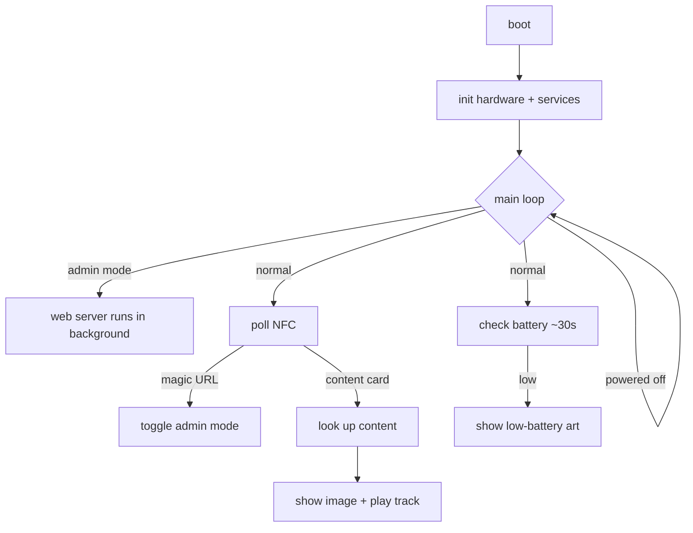
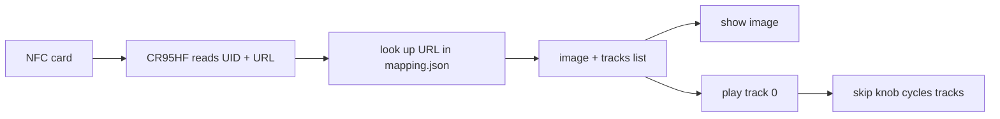

# open-yoto-firmware

A from-scratch firmware for the Yoto Player (ESP32). It reads NFC cards and
plays the matching audio + picture, with an offline admin mode for loading
your own content — **no Wi-Fi, Bluetooth, or cloud unless you explicitly turn
on admin mode**.

This page explains the logic in plain terms. The decompilation-based
understanding of the *original* firmware is elsewhere (see
[Hardware & Ports](hardware.md) and the [AI reference](ai/index.md)).

## The big picture



## What it does

1. **Scans an NFC card** → reads its URL.
2. **Looks up that URL** in a file on the SD card (`mapping.json`).
3. **Plays the matching audio** (MP3) and **shows the matching picture** (a
   16×16 pixel image).
4. The two knobs control **volume** (left) and **track skip** (right); pressing
   them **pauses**. Long-pressing the right knob or the power button turns the
   device **off/on**.
5. Scanning a special "magic" card toggles **admin mode** — a temporary Wi-Fi
   hotspot + web page. After unlocking with the 4-digit PIN, two tabs let you
   add a folder as a playlist (New) or browse/play/delete content (Browse).

## The components

| Component | Job |
|-----------|-----|
| `board` | the pin map (which wire goes where) |
| `iox` | the two I/O expander chips (buttons, display, power control) |
| `battery` | fuel-gauge + battery level / low-battery detection |
| `ht16d35x` | the 16×16 LED display |
| `cr95hf` | the NFC card reader |
| `encoder` | the two rotary knobs + push buttons + power button |
| `content` | the SD card + `mapping.json` catalog |
| `audio` + `codec_es8156` + `libhelix-mp3` | MP3 playback → headphone DAC |
| `admin` | the Wi-Fi hotspot + web page |
| `main` | ties it all together (the state machine) |

## Boot sequence

On power-up, in order:

1. Initialize settings storage (erase it if it's corrupt).
2. Start the I²C bus + both I/O expanders.
3. Battery monitor.
4. 16×16 display.
5. NFC reader.
6. Rotary encoders + buttons.
7. SD card + content catalog.
8. Audio.

Then it logs the battery level, checks it once, and enters the main loop.

## The main loop (the state machine)

It's one loop with three gates, then the real work:

1. **Powered off?** → sleep 200 ms, do nothing (the power button/knob still
   works because buttons are event-driven).
2. **Poll NFC** every ~100 ms in both normal and admin mode.
3. **Normal mode only** → every ~30 s check the battery (show the low-battery
   art if depleted).

A card is "new" on a rising edge or when its UID changes (a swap within one
poll window):

- **Magic URL** (`https://openyoto.local/admin`) → toggle admin mode on/off.
- **Admin mode, other card** → capture its URL for the web page's pre-fill.
- **Normal mode, other card** → look it up in the catalog; if found, show its
  image and start playing its first track (else show the "not found" X).

Removing the card stops playback; a swap (or rapid remove/re-insert) is
detected by UID change, not just presence.

The knobs/buttons are handled as events (not polled in the loop):

| Input | Action |
|-------|--------|
| Left knob turn | volume (5 per click, 0–100) |
| Right knob turn | skip track (wraps around) |
| Either knob press (short) | play / pause |
| Right knob press (long, ~0.8 s) | power off/on |
| Power button | power off/on |

Simultaneous or rapid presses are debounced so a double press can't
double-toggle power or cancel a play/pause.

## Card → playback flow



- The NFC reader talks over UART (57,600 baud). It reads the card's UID (4 or
  7 bytes) and its **NDEF URL**.
- The **URL is the key** (not the UID). `mapping.json` maps each URL to an
  ordered list of audio tracks, each with an optional per-track image:

  ```json
  {"cards": [{"url": "https://example.com/card",
              "image": "media/cover.img",
              "tracks": ["media/track1.mp3", "media/track2.mp3"],
              "track_images": ["media/track1.img", "media/track2.img"]}]}
  ```

- Images are **16×16, one-bit (32 raw bytes)** — pre-scaled in the browser, so
  the device just displays the bytes. Audio is MP3, streamed from the SD card.

## Audio pipeline

```
SD card → libhelix-mp3 (decode) → I2S → ES8156 headphone DAC
```

- A background task reads + decodes the MP3 and pushes 16-bit stereo samples
  (44.1 kHz) out the I²S port.
- Play/stop/pause/volume are simple flags + volume writes to the DAC.
- The speaker amp (`aw881xx`) is intentionally left off — its init sequence was
  never cracked; the **headphone path (ES8156) is the working output**.

## Admin mode

Scanning the magic card starts a temporary **open Wi-Fi hotspot** (`openyoto`,
at `192.168.4.1`) and a web server. The 4-digit access code appears on the
16×16 display. The web page shows only the access-code form until the correct
PIN is entered; then it reveals two tabs:

- **New** — select a folder of `.mp3` + images (the audio and its image share a
  name, different extension). The browser resizes each image to the 16×16
  bitmap (with previews) and uploads the folder as a playlist.
- **Browse** — each item shows its picture, track count, a play button (audio
  streams in the browser), and a delete button.
- **Scan a card** in admin mode to pre-fill the URL field with that card's URL;
  the page warns when the card already has content.

Routes: `GET /` (the page), `GET /api/list`, `GET /api/last-card`,
`GET /media/*` (serve files), `POST /api/add`, `POST /api/delete`,
`POST /api/login`.

## Power & battery

- Battery is read from a **CW2215B fuel gauge** (I²C), falling back to a raw
  ADC reading if the gauge is absent.
- **Low battery** = charge < 15% **or** voltage < 3.3 V — checked at boot and
  every ~30 s, showing the low-battery art (but not shutting down).
- **Charging** = the charger STAT line is asserted — checked at boot and every
  ~30 s. When charging, the display shows a lightning bolt and a battery bar
  whose fill is the rough state of charge (0–100%).
- "Off" is a software standby (stops audio + blanks the display); true
  deep-sleep power-off needs the I/O-expander interrupt pin as a wake source
  and isn't implemented yet.
