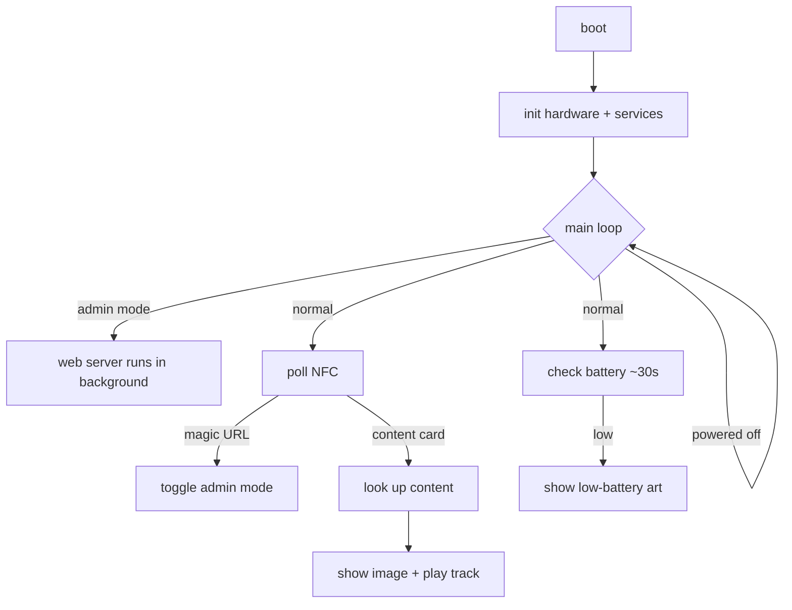
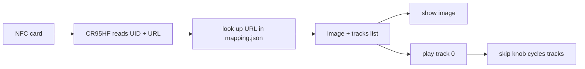

# open-yoto-firmware

A from-scratch firmware for the Yoto Player (ESP32). It reads NFC cards and
plays the matching audio + picture, with an offline admin mode for loading
your own content — **no Wi-Fi, Bluetooth, or cloud unless you explicitly turn
on admin mode**.

This page explains the logic in plain terms. The decompilation-based
understanding of the *original* firmware is elsewhere (see
[Hardware & Ports](hardware.md) and the [AI reference](ai/index.md)).

## The big picture



## What it does

1. **Scans an NFC card** → reads its URL.
2. **Looks up that URL** in a file on the SD card (`mapping.json`).
3. **Plays the matching audio** (MP3) and **shows the matching picture** (a
   16×16 pixel image).
4. The two knobs control **volume** (left) and **track skip** (right); pressing
   them **pauses**. Long-pressing the right knob or the power button turns the
   device **off/on**.
5. Scanning a special "magic" card toggles **admin mode** — a temporary Wi-Fi
   hotspot + web page. After unlocking with the 4-digit PIN, two tabs let you
   add a folder as a playlist (New) or browse/play/delete content (Browse).

## The components

| Component | Job |
|-----------|-----|
| `board` | the pin map (which wire goes where) |
| `iox` | the two I/O expander chips (buttons, display, power control) |
| `battery` | fuel-gauge + battery level / low-battery detection |
| `ht16d35x` | the 16×16 LED display |
| `cr95hf` | the NFC card reader |
| `encoder` | the two rotary knobs + push buttons + power button |
| `content` | the SD card + `mapping.json` catalog |
| `audio` + `codec_es8156` + `libhelix-mp3` | MP3 playback → headphone DAC |
| `admin` | the Wi-Fi hotspot + web page |
| `main` | ties it all together (the state machine) |

## Boot sequence

On power-up, in order:

1. Initialize settings storage (erase it if it's corrupt).
2. Start the I²C bus + both I/O expanders.
3. Battery monitor.
4. 16×16 display.
5. NFC reader.
6. Rotary encoders + buttons.
7. SD card + content catalog.
8. Audio.

Then it logs the battery level, checks it once, and enters the main loop.

## The main loop (the state machine)

It's one loop with three gates, then the real work:

1. **Powered off?** → sleep 200 ms, do nothing (the power button/knob still
   works because buttons are event-driven).
2. **Poll NFC** every ~100 ms in both normal and admin mode.
3. **Normal mode only** → every ~30 s check the battery (show the low-battery
   art if depleted).

A card is "new" on a rising edge or when its UID changes (a swap within one
poll window):

- **Magic URL** (`https://openyoto.local/admin`) → toggle admin mode on/off.
- **Admin mode, other card** → capture its URL for the web page's pre-fill.
- **Normal mode, other card** → look it up in the catalog; if found, show its
  image and start playing its first track (else show the "not found" X).

Removing the card stops playback; a swap (or rapid remove/re-insert) is
detected by UID change, not just presence.

The knobs/buttons are handled as events (not polled in the loop):

| Input | Action |
|-------|--------|
| Left knob turn | volume (5 per click, 0–100) |
| Right knob turn | skip track (wraps around) |
| Either knob press (short) | play / pause |
| Right knob press (long, ~0.8 s) | power off/on |
| Power button | power off/on |

Simultaneous or rapid presses are debounced so a double press can't
double-toggle power or cancel a play/pause.

## Card → playback flow



- The NFC reader talks over UART (57,600 baud). It reads the card's UID (4 or
  7 bytes) and its **NDEF URL**.
- The **URL is the key** (not the UID). `mapping.json` maps each URL to an
  ordered list of audio tracks, each with an optional per-track image:

  ```json
  {"cards": [{"url": "https://example.com/card",
              "image": "media/cover.img",
              "tracks": ["media/track1.mp3", "media/track2.mp3"],
              "track_images": ["media/track1.img", "media/track2.img"]}]}
  ```

- **rev #05 (HT16D35x)**: images are 16×16, one-bit (32 raw bytes),
  pre-scaled by the browser; the device displays those bytes directly.
- **rev #04 (GC9306)**: stock-compatible card art is **16×16 RGBA32** on
  both display revisions. The factory pipeline rejects decoded PNGs of any
  other size, alpha-composites the 1,024-byte frame, and nearest-neighbour
  scales it 12× for the TFT. The replacement's calibrated test path places
  that 192×192 frame at `(24,24)` after the device's observed 40px
  vertical correction and applies its observed RGB666 R/B output swap.

  A C PNG/JPEG renderer that retains original uploads and contain-fits them
  directly to 240×320 is an **optional rev #04-only enhancement**, not a
  reconstruction of the original behavior. It must calculate dimensions from
  each source image, letterbox rather than stretch, and establish its own
  physical-panel calibration; its former native-raster test used a 20px
  upward correction and does not generalize to the 192px stock frame.

## Audio pipeline

```text
SD content ──> Helix MP3 ─┐
                          ├─> mono 44.1 kHz PCM ─> I2S ─> ES8156 + AW881xx
YOTO_VFS welcome ─> M4A parser ─> Helix AAC-LC ─┘
```

- Normal boot plays only `/system/sounds/welcome`. The path is provided by a
  read-only `YOTO_VFS`; it is not an SD file.
- The embedded welcome asset is the exact 18,608-byte factory M4A from DROM
  `0x3f45014b–0x3f4549fb` (SHA-256
  `595d30ff7074658b6cda26d0412655e7adfb1e92c69ead2cbc0080eced895e2d`).
- Its MP4 sample tables describe 167 mono AAC-LC access units at 44.1 kHz.
  The replacement parses `stsd`/`stsz`/`stco`, decodes 171,008 samples, and
  pushes 16-bit mono PCM through the stock APLL I²S path.
- Local content remains MP3-capable. Stereo frames are downmixed before DMA,
  and bounded PCM gain affects both speaker and headphone output.
- Rev #04 uses one AW88194A at 7-bit `0x34`. The replacement reproduces the
  factory ET6416 reset, register table, SmartK firmware/configuration, VCALB,
  DSP/I²S/PLL checks, interrupt setup, and hard-unmute.
- `CONFIG_APP_SPEAKER_TEST_TONE` is disabled for normal boot. It remains a
  manual bring-up option and never runs alongside the configured welcome-only
  startup.

## Admin mode

Scanning the magic card starts a temporary **open Wi-Fi hotspot** (`openyoto`,
at `192.168.4.1`) and a web server. The 4-digit access code appears on the
16×16 display. The web page shows only the access-code form until the correct
PIN is entered; then it reveals two tabs:

- **New** — select a folder of `.mp3` + images (the audio and its image share a
  name, different extension). The browser continues to generate the 16×16
  bitmap for rev #05. For rev #04 it must upload the original PNG/JPEG along
  with metadata; C performs the best-fit decode/render path on-device.
- **Browse** — each item shows its picture, track count, a play button (audio
  streams in the browser), and a delete button.
- **Scan a card** in admin mode to pre-fill the URL field with that card's URL;
  the page warns when the card already has content.

Routes: `GET /` (the page), `GET /api/list`, `GET /api/last-card`,
`GET /media/*` (serve files), `POST /api/add`, `POST /api/delete`,
`POST /api/login`.

## Power & battery
- Battery state comes from the CW2215B fuel gauge when its VCELL/SOC data is
  nonzero and valid; an ACKing gauge that reports an all-zero frame is treated
  as inactive and falls back to ADC voltage with unknown SOC. `IOX_CHG_STAT`
  is active-low and controls charging state even when SGM41513 I²C does not
  ACK; `IOX_PLUG_STAT` is logged separately for USB diagnostics.
- **Low battery** = charge < 15% **or** voltage < 3.3 V — checked at boot and
  every ~30 s, showing the low-battery art (but not shutting down).
- When charging, the display shows a lightning bolt and a battery bar whose
  fill is the rough state of charge (0–100%).
- "Off" is a software standby (stops audio + blanks the display); true
  deep-sleep power-off needs the I/O-expander interrupt pin as a wake source
  and isn't implemented yet.
